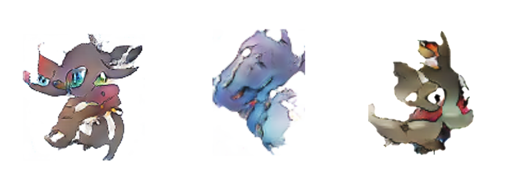

# **PokémonGAN**
A generative adversarial network that creates new Pokémon from a random noise vector.

## Generated samples:

    

## Training progress:

## Creating dataset (optional)
* Raw images are located under the `raw_dataset` directory
* To create `training_dataset`, run `python image_preprocessing.py`

## Training
* Open `PokemonGAN.ipynb` in Colab and follow instructions in the notebook.
* Root folder: `My Drive/PokemonGAN`
* Training samples generated by `vis_noise.npy` will save to `PokemonGAN/training_samples`.
* Weights will save to `PokemonGAN/weights`

## Visualizing training
* Once training is complete, download the `training_samples` directory from your Drive
* Run `python make_training_GIF.py`

